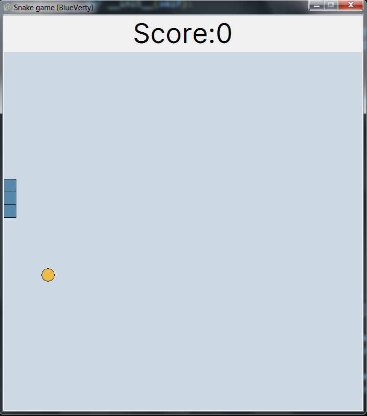
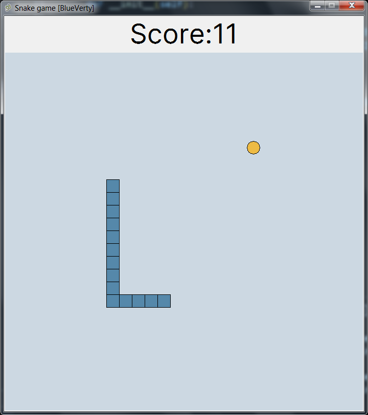
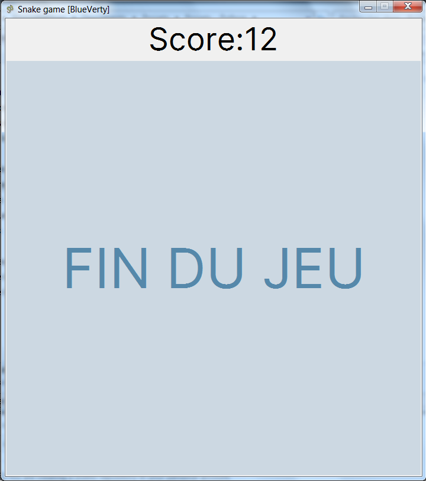

# Snake Game
## Description
Create your own standard **Snake Game** App with *Python 3* and *tkinter library*.

> *Tkinter is already in your python's workstation without any *pip* installation.*

Invite you to experience this game, although simple, it has an acceptable pleasure. Enjoy the experience.

## Screenshot




---

## Create Standalone Executable
Of course, with python you can convert main file (.py) to executable file (.exe), just a few script in powershell or cmd if you work on windows environment:

```shell
pip install pyinstaller
pyinstaller --onefile -w main.py
```
